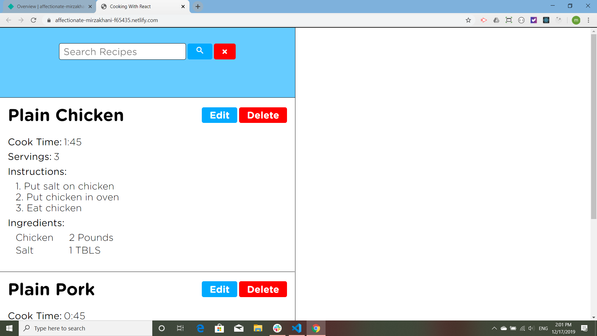
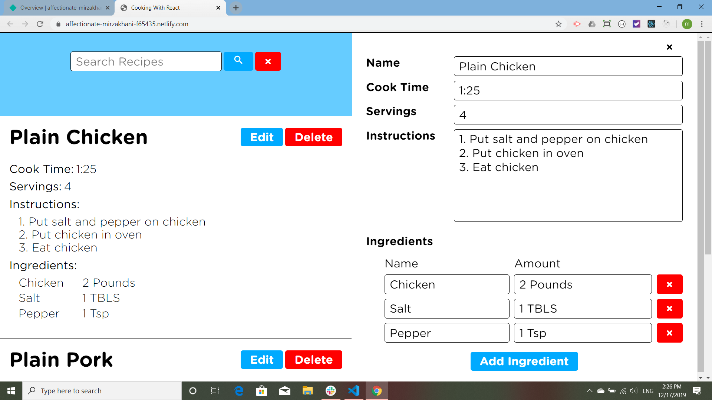
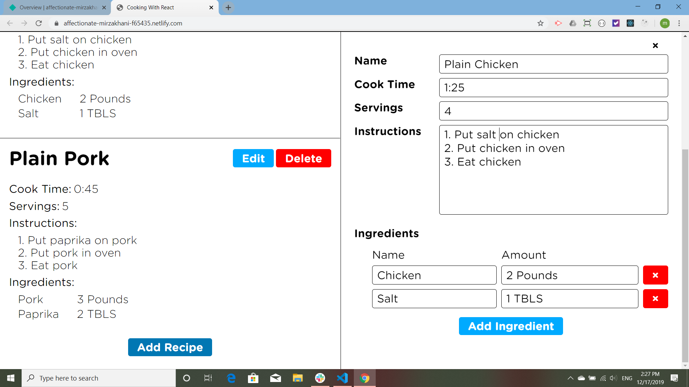
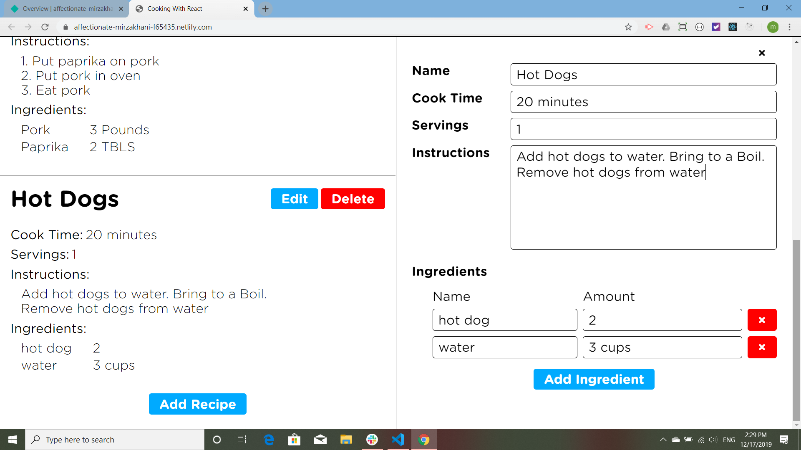
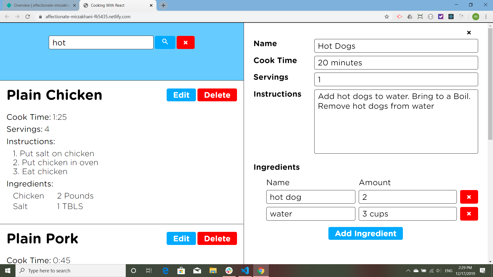
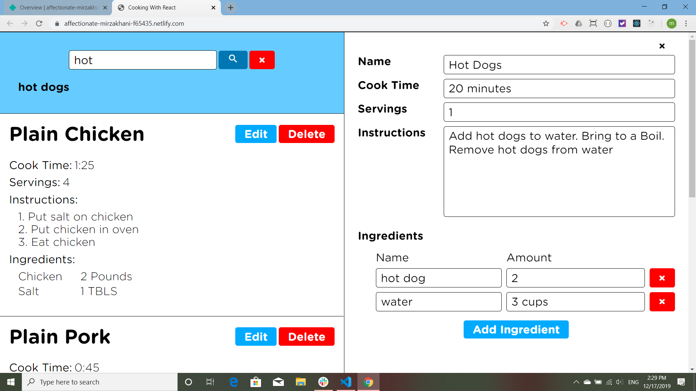
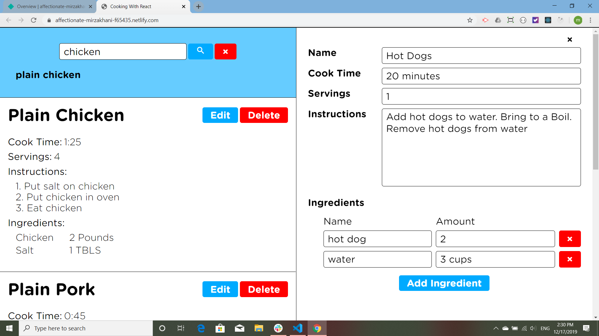
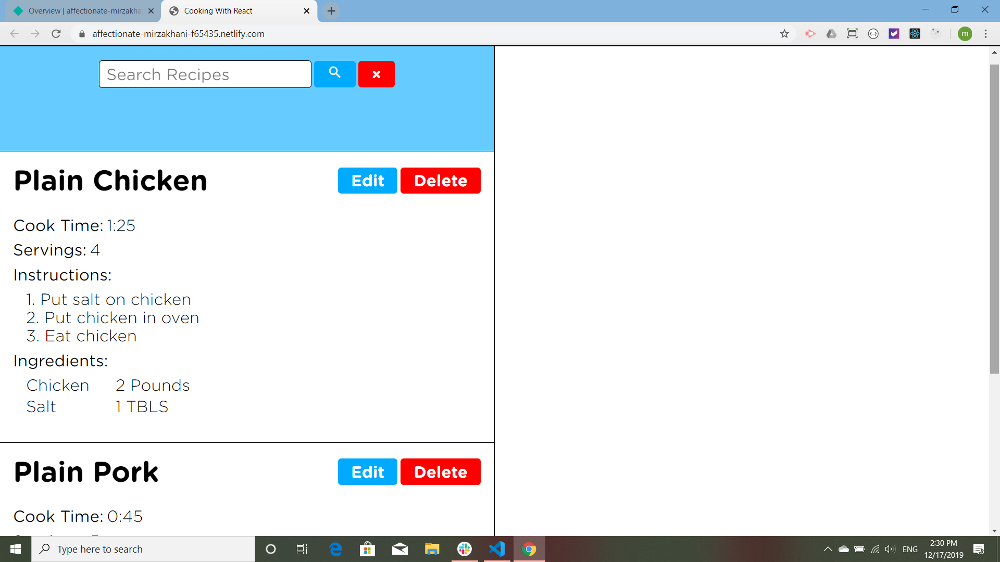

## Cooking With React

*Cooking With React* is based on the *Web Dev Simplified* tutorial called [Learn React Today](https://www.youtube.com/watch?v=518L3GYUf48). All the code and the CSS for the recipe, add recipe and edit recipe components are from the tutorial, but on the suggestion of the tutorial developer, the login component is mine. At some later time I would like to expand on this app, but ... in the future.

Here is the app upon opening:

Here the edit button is pressed on the *Plain Chicken* recipe:

Here I add -gasp! pepper:

The pepper is taken away:

The add recipe function:

A recipe for hotdogs is added:

Now I will search for that recipe:

This was the hardest part of the search button for me, making it wait to search until the button is pressed:

Now I look for chicken:

I find chicken!

The hotdog recipe is deleted.

*Cooking With React* is [deployed](https://affectionate-mirzakhani-f65435.netlify.com/) on [Netlify](https://www.netlify.com/). Thank you [Web Dev Simplified](https://www.youtube.com/channel/UCFbNIlppjAuEX4znoulh0Cw) for the great tutorial!